# OCM Demo Playground

This repository provides a comprehensive playground for exploring the Open Component Model (OCM) ecosystem. It includes examples ranging from basic component creation to advanced Kubernetes deployments using OCM K8s Toolkit.

## 🎯 What is OCM?

The Open Component Model (OCM) is an open standard for describing software bill of deliveries (SBOD). It provides:

- **Unified format** for packaging and describing software artifacts
- **End-to-end security** with cryptographic signatures and provenance
- **Universal delivery** across environments (public cloud, on-prem, air-gapped)
- **GitOps-ready automation** with seamless integration

## 📋 Prerequisites

- Docker and Docker Compose
- [kind](https://kind.sigs.k8s.io/) for local Kubernetes clusters
- [kubectl](https://kubernetes.io/docs/tasks/tools/#kubectl)
- [OCM CLI](https://ocm.software/docs/getting-started/installation/)
- [Flux CLI](https://fluxcd.io/flux/installation/) (for Kubernetes examples)

## 🚀 Quick Start

1. **Set up the environment:**
   ```bash
   ./scripts/setup-environment.sh
   ```

2. **Run the 5-minute demo tour:**
   ```bash
   ./scripts/quick-demo.sh
   # or via utils
   ./scripts/ocm-utils.sh demo
   ```

3. **Start with basic examples:**
   ```bash
   cd examples/01-basic
   ./run-examples.sh
   ```

3. **Start with basic examples:**
   ```bash
   cd examples/01-basic
   ./run-examples.sh
   ```

4. **Explore component transport:**
   ```bash
   cd examples/02-transport/local-to-oci
   ./transport-example.sh
   ```

5. **Learn about signing and verification:**
   ```bash
   cd examples/03-signing/basic-signing
   ./sign-component.sh
   ```

6. **Deploy to Kubernetes:**
   ```bash
   cd examples/04-k8s-deployment
   ./setup-cluster.sh
   cd ocm-k8s-toolkit
   ./deploy-example.sh
   ```

7. **Use utility scripts for common tasks:**
   ```bash
   ./scripts/ocm-utils.sh --help
   ```

8. **Validate everything works with the test suite:**
   ```bash
   ./scripts/test-all.sh
   # or via utils
   ./scripts/ocm-utils.sh test-all
   ```

## 🌊 Learning Flow Visualization

```mermaid
graph TD
    A[🚀 Start: OCM Demo] --> B[🛠️ Environment Setup]
    B --> C{Choose Learning Path}
    
    C --> D[📝 01-Basic<br/>Component Creation]
    C --> E[🚀 02-Transport<br/>Registry Movement]
    C --> F[🔐 03-Signing<br/>Security & Trust]
    C --> G[☸️ 04-K8s<br/>Deployment]
    
    D --> D1[Hello World]
    D1 --> D2[Multi-Resource]
    D2 --> E
    
    E --> E1[Local → OCI]
    E1 --> E2[Offline Transport]
    E2 --> F
    
    F --> F1[Key Generation]
    F1 --> F2[Digital Signing]
    F2 --> G
    
    G --> G1[Kind Cluster]
    G1 --> G2[OCM K8s Toolkit]
    G2 --> H[🎯 Production Ready]
    
    I[🛠️ OCM Utils] -.-> D
    I -.-> E
    I -.-> F
    I -.-> G
    
    style A fill:#e1f5fe
    style H fill:#e8f5e8
    style I fill:#fff3e0
```



> 💡 **Tip**: For detailed flow diagrams and component lifecycle visualization, see [docs/ocm-demo-flow.md](docs/ocm-demo-flow.md)

## 📁 Repository Structure

```
osm-demo/
├── scripts/              # Setup and utility scripts
│   ├── setup-environment.sh    # Automated environment setup
│   └── ocm-utils.sh            # Common operations utility
├── examples/             # Progressive learning examples
│   ├── 01-basic/         # Basic component creation
│   │   ├── hello-world/         # Simple first component
│   │   ├── multi-resource/      # Multiple resources in component
│   │   └── run-examples.sh      # Run all basic examples
│   ├── 02-transport/     # Component transport between registries
│   │   ├── local-to-oci/        # Local archive to OCI registry
│   │   └── offline-transport/   # Air-gapped transport with CTF
│   ├── 03-signing/       # Cryptographic signing and verification
│   │   └── basic-signing/       # RSA signing and verification
│   └── 04-k8s-deployment/ # Kubernetes deployment patterns
│       ├── setup-cluster.sh     # Kind cluster setup
│       └── ocm-k8s-toolkit/     # OCM K8s integration example
└── docs/                 # Additional documentation
```
│   └── 05-advanced/   # Advanced scenarios
├── docs/             # Additional documentation
└── infrastructure/   # Local infrastructure setup
```

## 🧩 Examples Overview

### 1. Basic Examples (`examples/01-basic/`)
- Creating your first OCM component
- Adding resources (OCI images, Helm charts, files)
- Working with different access types
- Component descriptors and metadata

### 2. Transport Examples (`examples/02-transport/`)
- Moving components between repositories
- Local to OCI registry transport
- Cross-registry replication
- Transport with different storage backends

### 3. Signing Examples (`examples/03-signing/`)
- Signing component versions
- Verification workflows
- Trust chains and certificates
- Signature algorithms

### 4. Kubernetes Deployment (`examples/04-k8s-deployment/`)
- OCM K8s Toolkit setup
- ResourceGraphDefinitions with Kro
- FluxCD integration
- GitOps workflows
- Bootstrap scenarios

### 5. Advanced Examples (`examples/05-advanced/`)
- Component references and aggregation
- Localization and configuration
- Multi-environment scenarios
- Custom access methods

## 🛠️ Available Examples and Features

### 📝 01-Basic: Component Fundamentals
- **Hello World**: Create your first OCM component with a simple text resource
- **Multi-Resource**: Package multiple resources (configs, scripts, docs) in one component
- **Metadata & Labels**: Add component metadata and resource labels
- Learn: Component descriptors, resource access types, OCM CLI basics

### 🚀 02-Transport: Component Movement
- **Local to OCI**: Transport components from local archives to OCI registries
- **Cross-Registry**: Move components between different registry instances
- **Offline Transport**: Air-gapped scenarios using Common Transport Format (CTF)
- Learn: Storage backends, registry operations, offline distribution

### 🔐 03-Signing: Security & Trust
- **Digital Signatures**: Sign components with RSA keys for integrity
- **Signature Verification**: Verify component authenticity and detect tampering
- **Key Management**: Generate and manage signing keys securely
- Learn: Cryptographic signing, trust policies, security workflows

### ☸️ 04-K8s-Deployment: Kubernetes Integration
- **OCM K8s Toolkit**: Deploy components using native OCM Kubernetes integration
- **Kind Cluster Setup**: Automated local Kubernetes cluster with OCM support
- **GitOps with Flux**: Continuous delivery using FluxCD and OCM
- Learn: Kubernetes deployment patterns, GitOps workflows, cloud-native integration

### 🛠️ Utility Scripts
- **Quick Demo**: Interactive 5-minute tour of key OCM capabilities
- **Environment Setup**: Automated installation of OCM CLI, kind, kubectl, Flux
- **Registry Management**: Start/stop/reset local OCI registries
- **Component Listing**: View components in registries
- **Test Suite**: Comprehensive validation of all examples and functionality
- **Cleanup Tools**: Clean up demo environments and artifacts

## 🎯 Learning Path

### Quickstart (5 minutes)
0. Run the interactive demo tour: `./scripts/quick-demo.sh`

### Beginner (30 minutes)
1. Run environment setup: `./scripts/setup-environment.sh`
2. Complete basic examples: `cd examples/01-basic && ./run-examples.sh`
3. Try simple transport: `cd examples/02-transport/local-to-oci && ./transport-example.sh`

### Intermediate (1 hour)
4. Explore component signing: `cd examples/03-signing/basic-signing && ./sign-component.sh`
5. Set up Kubernetes: `cd examples/04-k8s-deployment && ./setup-cluster.sh`
6. Deploy to K8s: `cd ocm-k8s-toolkit && ./deploy-example.sh`

### Advanced (2+ hours)
7. Experiment with offline transport scenarios
8. Build custom components with your own applications
9. Integrate with existing CI/CD pipelines
10. Explore production deployment patterns

## 🧪 Testing and Validation

The playground includes comprehensive testing to ensure all examples work correctly:

### Quick Validation
```bash
# Run all tests
./scripts/test-all.sh

# Skip time-consuming tests
./scripts/test-all.sh --skip-long

# Skip Kubernetes tests
./scripts/test-all.sh --skip-k8s

# Via utility script
./scripts/ocm-utils.sh test-all
```

### Test Coverage
- ✅ **Script Validation**: Syntax checking and executable permissions
- ✅ **Environment Setup**: Tool installation and configuration
- ✅ **Basic Examples**: Component creation and resource handling
- ✅ **Transport Examples**: Registry operations and offline transport
- ✅ **Signing Examples**: Cryptographic operations and verification
- ✅ **K8s Deployment**: Cluster setup and component deployment
- ✅ **Utility Functions**: All helper scripts and operations
- ✅ **Documentation**: README files and guide completeness
- ✅ **Performance**: Basic performance validation

### CI/CD Integration
The test suite is designed for CI/CD environments:
```bash
# Minimal testing for CI
./scripts/test-all.sh --skip-k8s --skip-long

# Full validation (recommended for releases)
./scripts/test-all.sh
```

## 🛠️ Tools and Technologies

This playground demonstrates integration with:

- **[OCM CLI](https://ocm.software/)** - Core OCM tooling
- **[OCM K8s Toolkit](https://github.com/open-component-model/ocm-k8s-toolkit)** - Kubernetes controllers
- **[Kro](https://kro.run/)** - Resource orchestration
- **[FluxCD](https://fluxcd.io/)** - GitOps delivery
- **[kind](https://kind.sigs.k8s.io/)** - Local Kubernetes clusters

## 🆘 Troubleshooting

See [docs/troubleshooting.md](docs/troubleshooting.md) for common issues and solutions.

## 🤝 Contributing

Contributions are welcome! Please see our [contributing guidelines](docs/contributing.md).

## 📄 License

This project is licensed under the Apache License 2.0 - see the [LICENSE](LICENSE) file for details.

## 🔗 Related Links

- [OCM Website](https://ocm.software)
- [OCM Specification](https://github.com/open-component-model/ocm-spec)
- [OCM K8s Toolkit](https://github.com/open-component-model/ocm-k8s-toolkit)
- [OCM Community](https://github.com/open-component-model/community)
