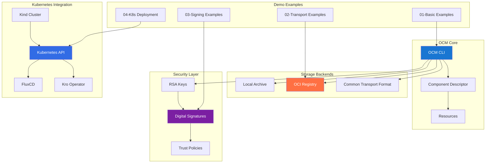
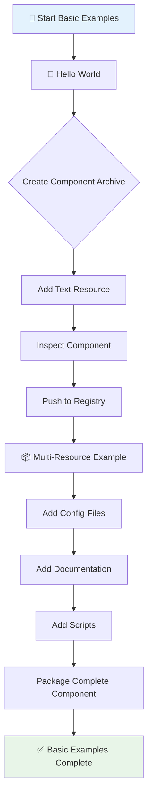
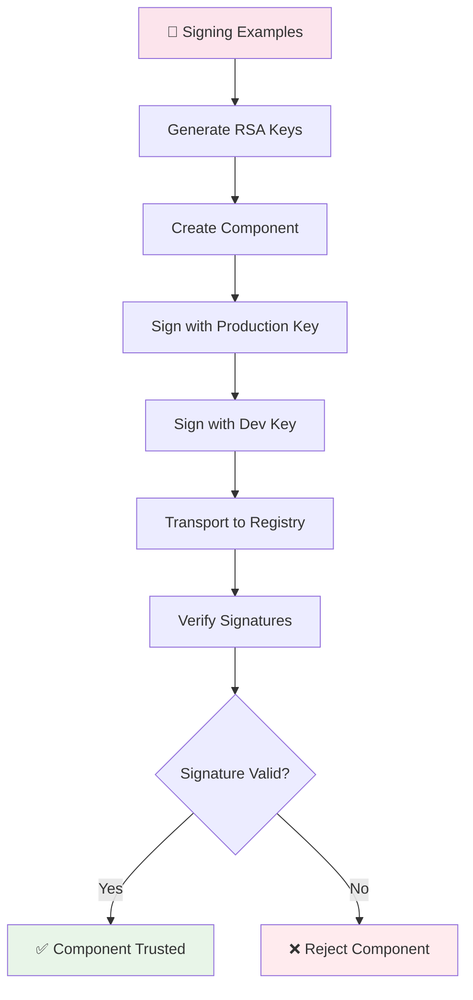
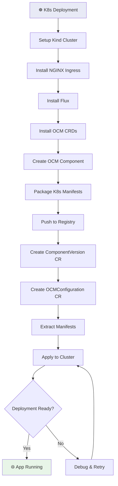
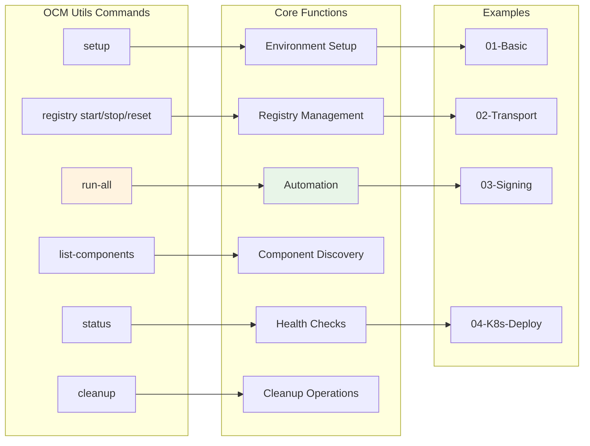
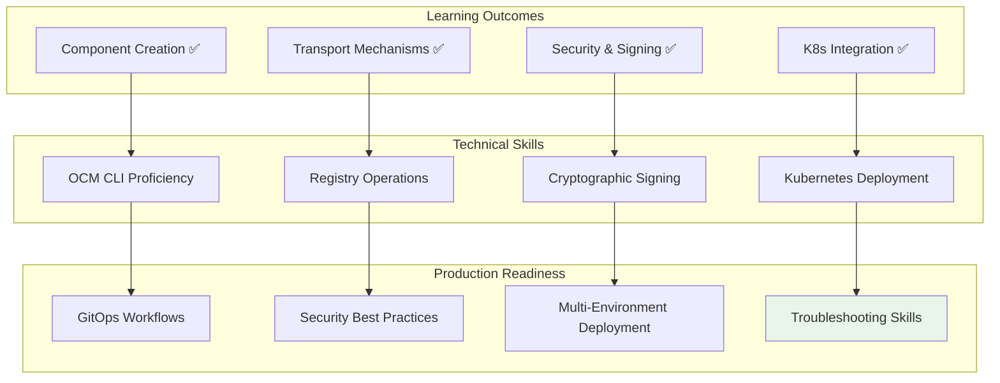

# OCM Demo Playground Flow Diagram

This document contains mermaid diagrams that visualize the complete OCM demo playground workflow, from basic component creation to advanced Kubernetes deployments.

## 🌊 Complete Learning Flow

```mermaid
graph TD
    A[🚀 Start: OCM Demo Playground] --> B[📋 Prerequisites Check]
    B --> C[🛠️ Environment Setup]
    C --> D{Choose Learning Path}
    
    D --> E[📝 01-Basic Examples]
    D --> F[🚀 02-Transport Examples] 
    D --> G[🔐 03-Signing Examples]
    D --> H[☸️ 04-K8s Deployment]
    
    %% Basic Examples Flow
    E --> E1[Hello World Component]
    E1 --> E2[Multi-Resource Component]
    E2 --> E3[Metadata & Labels]
    E3 --> F
    
    %% Transport Examples Flow
    F --> F1[Local to OCI Registry]
    F1 --> F2[Cross-Registry Replication]
    F2 --> F3[Offline Transport (CTF)]
    F3 --> G
    
    %% Signing Examples Flow
    G --> G1[Key Generation]
    G1 --> G2[Component Signing]
    G2 --> G3[Signature Verification]
    G3 --> H
    
    %% Kubernetes Deployment Flow
    H --> H1[Kind Cluster Setup]
    H1 --> H2[OCM K8s Toolkit]
    H2 --> H3[Component Deployment]
    H3 --> I[🎯 Production Ready]
    
    %% Utility Integration
    J[🛠️ OCM Utils] --> E
    J --> F
    J --> G
    J --> H
    
    style A fill:#e1f5fe
    style I fill:#e8f5e8
    style J fill:#fff3e0
```

## 🔄 Component Lifecycle Flow

```mermaid
graph LR
    subgraph "Development"
        A1[📝 Create Source] --> A2[📋 Component Descriptor]
        A2 --> A3[📦 Package Resources]
    end
    
    subgraph "Security"
        B1[🔑 Generate Keys] --> B2[✍️ Sign Component]
        B2 --> B3[✅ Verify Signature]
    end
    
    subgraph "Transport"
        C1[📂 Local Archive] --> C2[🚀 Push to Registry]
        C2 --> C3[🔄 Cross-Registry]
        C3 --> C4[💾 Offline Bundle]
    end
    
    subgraph "Deployment"
        D1[☸️ K8s Cluster] --> D2[🛠️ OCM Toolkit]
        D2 --> D3[📋 Apply Manifests]
        D3 --> D4[🌐 Running App]
    end
    
    A3 --> B1
    B3 --> C1
    C4 --> D1
    
    style A1 fill:#e3f2fd
    style B2 fill:#fce4ec
    style C2 fill:#e8f5e8
    style D4 fill:#f3e5f5
```



## 🏗️ Architecture and Tool Integration



## 📚 Detailed Example Flows

### 01-Basic Examples Flow



### 02-Transport Examples Flow

```mermaid
flowchart LR
    T1[🚀 Transport Examples] --> T2[Local Archive]
    T2 --> T3[OCI Registry A]
    T3 --> T4[OCI Registry B]
    T4 --> T5[Common Transport Format]
    T5 --> T6[Air-Gapped Environment]
    T6 --> T7[Target Registry]
    
    T2 -.->|"Local to OCI"| T3
    T3 -.->|"Cross-Registry"| T4
    T4 -.->|"Export CTF"| T5
    T5 -.->|"Physical Transport"| T6
    T6 -.->|"Import CTF"| T7
    
    style T1 fill:#fff3e0
    style T7 fill:#e8f5e8
```



### 03-Signing Examples Flow



### 04-K8s Deployment Flow



## 🛠️ Utility Scripts Integration



## 🎯 Success Metrics and Outcomes



## Usage

To view these diagrams:

1. **In GitHub**: The diagrams will render automatically in GitHub's markdown viewer
2. **In VS Code**: Install the "Mermaid Preview" extension
3. **Online**: Copy the mermaid code to [mermaid.live](https://mermaid.live)
4. **Local**: Use mermaid-cli: `npx @mermaid-js/mermaid-cli -i ocm-demo-flow.md -o ocm-demo-flow.html`

## Interactive Exploration

Each diagram section corresponds to specific examples in the playground:

- **Learning Flow**: Follow the recommended path through `examples/`
- **Component Lifecycle**: Understand the complete journey from creation to deployment
- **Architecture**: See how tools integrate in the OCM ecosystem
- **Example Flows**: Detailed walkthrough of each example section
- **Utility Integration**: How helper scripts support the learning experience
